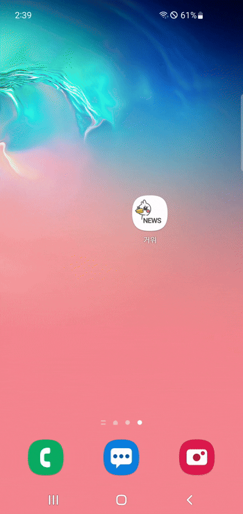
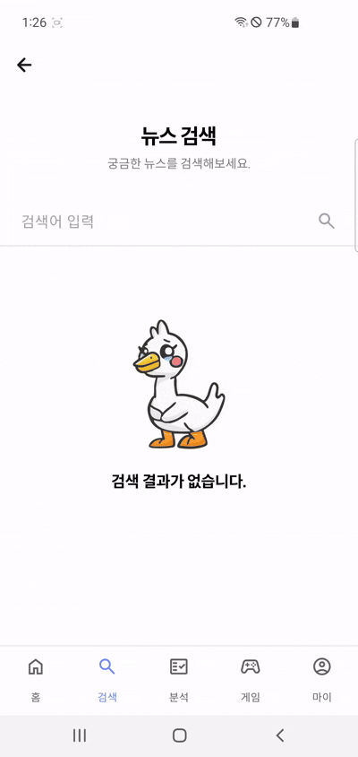
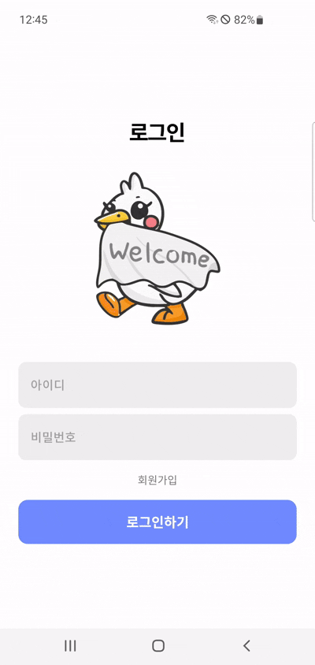
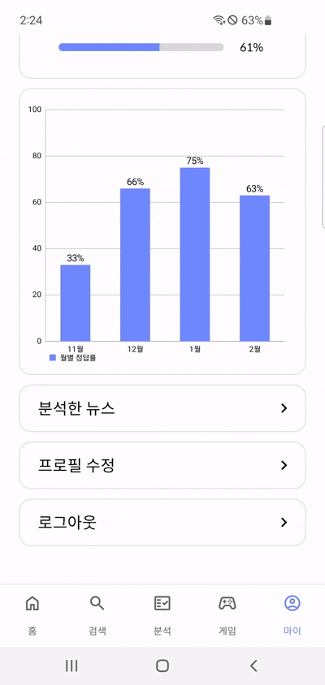
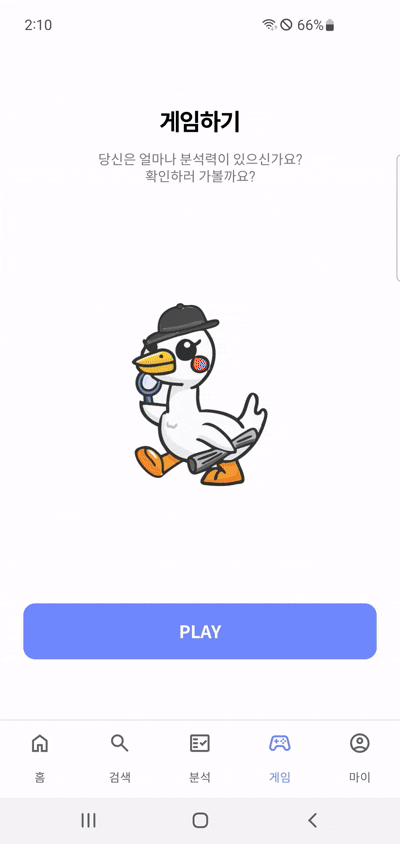
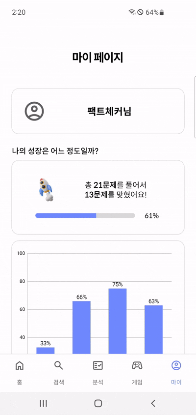
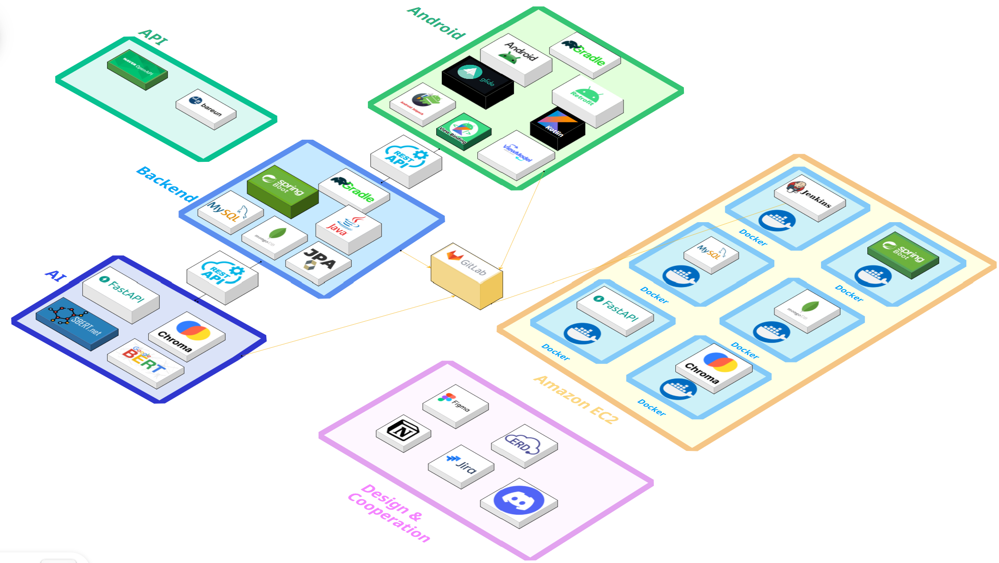
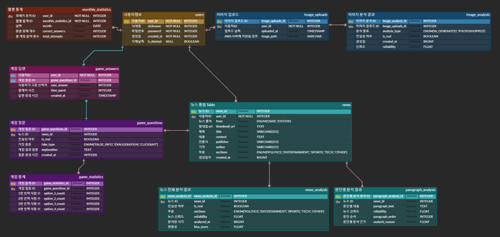

  <h1>거위 - 거짓뉴스는 위험해</h1>
  
📚 AI 분석을 통해 뉴스의 신뢰성을 분석해주는 서비스 📚

 

    <!-- 우리 앱 설명 이미지 넣기 -->
    

 

  <a href="">API 문서</a>
  &nbsp; | &nbsp;
  <a href="">기능 명세서</a>
  &nbsp; | &nbsp;
  <a href="">Notion</a>

 

## ✍️ 프로젝트 개요

- **프로젝트명:** 거위
- **프로젝트 기간:** 2025.01.06 ~ 2025.02.21
- **SSAFY 12기 공통 프로젝트**

---

## ✍️ 프로젝트 소개

### 프로젝트 배경

최근 유튜브나 SNS에서 가짜 뉴스가 빠르게 확산되며, 많은 
사람들이 잘못된 정보를 사실로 받아들이는 사례가 증가하고 있습니다. 
이는 개인의 판단뿐만 아니라 사회 전반에 걸쳐 큰 영향을 미칠 수 있으며, 
정치, 경제, 건강 등 다양한 분야에서 심각한 문제를 초래하고 있습니다. 
특히, 특정한 이익을 위해 조작된 정보는 사회적 혼란을 야기합니다.

이러한 문제를 해결하기 위해, 우리는 뉴스의 진위 여부를 판별하는 서비스를 개발하고자 합니다.
AI 모델을 활용하여 가짜 뉴스 문장을 학습하고, 
문장 및 문단 단위로 뉴스의 신뢰도를 평가합니다.
또한, 유사한 뉴스들과 비교 분석을 통해 뉴스의 편향성, AI 여부, 신뢰성을 진단합니다.

### 문제점 해결

- 뉴스 분석 기능: 사용자가 뉴스 기사의 단락 캡쳐 이미지를 통해 
텍스트를 추출 및 내용을 입력하거나 URL 정보를 입력해, 유사한 뉴스 정보 및 분석 정보 제공합니다.
- 거짓 뉴스 판별 게임: 사용자의 거짓 뉴스 분석 능력을 향상시키기 위해,
가짜 뉴스의 어떤 부분이 허위인지 판별하는 기능을 제공합니다.
- 최신 뉴스 정보 제공: 인기 키워드를 기반으로 뉴스를 크롤링하여 
실시간 뉴스 및 분석된 정보를 제공합니다.
---

## 🚀 프로젝트 목표

1. **가짜 뉴스 판별 AI 서비스 개발:** 
   - AI 모델을 활용하여 뉴스 기사의 신뢰도를 분석하고, 문장 및 문단 단위로 사실 여부를 판별하는 기능을 구현합니다.
    - 뉴스 기사 내 허위 정보 여부를 사용자에게 직관적으로 제공하여 신뢰할 수 있는 정보를 제공합니다.

2. **뉴스 검증 및 비교 분석 기능 제공:** 
   - 사용자가 뉴스 기사 내용을 직접 입력하거나 URL을 입력하면, 해당 뉴스와 유사한 뉴스들을 비교하여 신뢰도를 평가합니다.
    - 뉴스의 출처, 편향성, AI 생성 여부 등을 분석하여 사용자에게 보다 객관적인 정보를 제공합니다.

3. **실시간 뉴스 및 분석 정보 제공:** 
   - 인기 키워드를 기반으로 뉴스 데이터를 크롤링하여 실시간 뉴스를 제공합니다.
   - AI가 분석한 뉴스의 신뢰도 정보를 함께 제공하여, 사용자들이 보다 신뢰할 수 있는 뉴스를 선별할 수 있도록 돕습니다.

## 📊 기대 효과

### 플랫폼
- **사용자 맞춤형 뉴스 분석 제공**: 사용자의 뉴스 검색 및 분석 이력을 바탕으로 맞춤형 뉴스 신뢰도 분석 서비스를 제공합니다.
- **반복 학습을 통한 지속적인 판별 능력 향상**: 다양한 유형의 가짜 뉴스 사례를 제공하여 사용자가 반복 학습을 통해 뉴스 판별 능력을 향상할 수 있도록 지원합니다.

### 사용자
- **다양한 뉴스 검증 콘텐츠 제공**: 뉴스 신뢰도 분석, AI 생성 여부 감지, 편향성 분석 등 다양한 기능을 통해 종합적인 뉴스 검증을 지원합니다.
- **시각적 분석 결과 제공을 통한 직관적 이해 지원**: 뉴스 신뢰도를 그래프 및 시각적 데이터로 표현하여 사용자들이 뉴스의 신뢰도를 보다 쉽게 이해할 수 있도록 돕습니다.
- **미디어 리터러시 향상 및 가짜 뉴스 판별 역량 강화**: ‘거짓 뉴스 맞추기’ 게임과 뉴스 분석 기능을 통해 사용자들이 가짜 뉴스를 판별하는 능력을 자연스럽게 습득할 수 있도록 유도합니다.

---

 ## 📌 주요 기능

### 1️⃣ <b>메인 페이지</b>
> 메인 페이지

|                     **Splash Page**                      |                        **Home Page**                        |                       **Search Page**                        |
| :-----------------------------------------------------: | :---------------------------------------------------------: | :--------------------------------------------------------: |
|  |  |  |

 

### 2️⃣ <b>로그인 페이지</b>

> 로그인 페이지

|                      **Login Page**                      |                      **Logout Page**                      |                 
| :--------------------------------------------------------: | :---------------------------------------------------------: |
|  |  |

 

### 3️⃣ <b>분석 페이지</b>

> 분석 페이지

|                      **Image Check**                      |                      **URL Check**                      |                       **Live Cam Check**                      |
| :--------------------------------------------------------: | :---------------------------------------------------------: | :---------------------------------------------------------: |
|  |  |  |

 

### 4️⃣ <b>게임 페이지</b>

> 게임 페이지

|                      **Game Page**                      |
| :--------------------------------------------------------: | 
|  |

 

### 5️⃣ <b>마이 페이지</b>

> 마이 페이지

|                      **My Analy Page**                      |                      **Profile Edit Page**                      |                 
| :--------------------------------------------------------: | :---------------------------------------------------------: |
|  |  | 
 

---

## 🧑‍💻 팀원 소개

| **강인혁** | **권정민** | **구민성** | **박장훈** | **민수현** | **양다혜** | 
|:----------:|:----------:|:----------:|:----------:|:----------:|:----------:|
| 팀장 & Infra & BE | BE & AI | BE & AI | UI/UX & AOS | UI/UX & AOS | UI/UX & AOS |

---

## ⚙️ 기술 스택

<table>
    <thead>
        <tr>
            <th>분류</th>
            <th>기술 스택</th>
        </tr>
    </thead>
    <tbody>
        <tr>
            <td>안드로이드</td>
            <td>
                
                
            </td>
        </tr>
        <tr>
            <td>백엔드</td>
            <td>
                
                
                
                
            </td>
        </tr>
        <tr>
            <td>데이터베이스</td>
            <td>
                
                
                
            </td>
        </tr>
        <tr>
            <td>AI</td>
            <td>
                
                
                
            </td>
        </tr>
        <tr>
            <td>데이터</td>
            <td>
                
                
                
                
                
            </td>
        </tr>
        <tr>
            <td>인프라</td>
            <td>
                
                
                
                
            </td>
        </tr>
        <tr>
            <td>API</td>
            <td>
                
                
            </td>
        </tr>
        <tr>
            <td>협업 도구</td>
            <td>
                
                
                
                
                
            </td>
        </tr>
    </tbody>
</table>

---

## 🔨 시스템 아키텍처

---

## 📊 ERD

<!-- ---

## 📂 문서 자료

- [포팅 메뉴얼]()
- [시연 시나리오]()
- [발표 자료]()
- [DATA]()

--- -->
